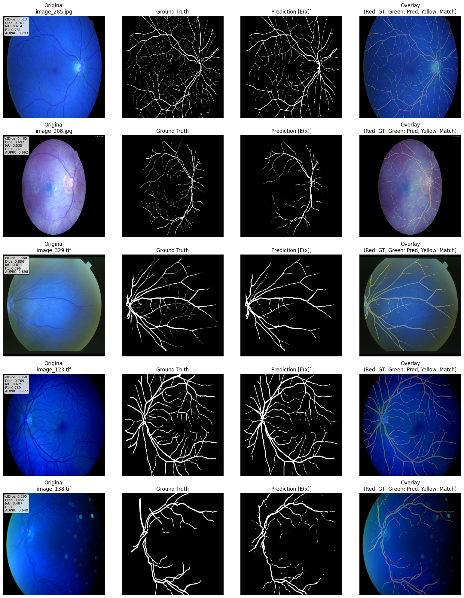

# Boundary-Aware Attention U-Net (BaAtt-U-Net)

*A lightweight add-on for U-Net that injects fixed Sobel-edge priors into the
skip-connection attention gates, boosting retinal-vessel topology metrics with
**zero extra trainable parameters**.*

> Adding a Sobel edge map to the gating logits improves **clDice by ≈ 2.9 %**
> and **IoU by ≈ 2.7 %** over a strong U-Net baseline while keeping runtime
> overhead under 1 %.

---

## ✨ Key Features

* **Boundary-aware attention gates** – encoder features are modulated by a
  normalized Sobel edge map before skip fusion.  
* **No extra params** – Sobel filters are fixed, differentiable, and GPU-friendly.  
* **Plug-and-play** – ~40 LOC; works with any U-Net variant.  
* **Clinically meaningful gains** – fewer spurious branches, better topology.

---

## 🔬 Method Overview

1. Convert the encoder feature map to grayscale and convolve with 3 × 3 Sobel
   kernels.  
2. Compute gradient magnitude and batch-normalize to \[0, 1].  
3. Add the scaled edge map to attention logits  

   \[
   \alpha_{\text{ba}} = \sigma\!\bigl(\psi + \lambda\,E(x)\bigr),\quad
   \lambda = 0.1
   \]

4. Multiply the resulting mask with the original skip tensor.

See **`models/ba_att_gate.py`** for a minimal reference implementation.

---

## 📊 Results (on CHASE_DB1 retinal vessels)

| Metric              | U-Net Baseline | **BaAtt-U-Net** | Δ |
|---------------------|:--------------:|:---------------:|--:|
| clDice              | 0.385 ± 0.065  | **0.396 ± 0.065** | **+2.9 %** |
| Vessel IoU          | 0.615 ± 0.079  | **0.632 ± 0.096** | **+2.7 %** |
| Boundary F1         | 0.895 ± 0.044  | **0.910 ± 0.034** | **+1.6 %** |
| Spurious Branches ↓ | 0.122          | **0.108**        | **–11.2 %** |

(Exact numbers and ablations are in **`boundary-aware-attention-UNET.pdf`**.)

---
## 📈 Qualitative Result

<p align="center">
  
</p>


## 📄 Citation

```bibtex
@inproceedings{bandyopadhyay2025baattunet,
  title     = {Boundary-Aware Attention U-Net for Retinal Blood Vessel Segmentation},
  author    = {Subhasish Bandyopadhyay},
  booktitle = {Proceedings of MICCAI},
  year      = {2025}
}

